# Bring Your Own AI Gateway to Foundry (Preview)

> **🚀 Enterprise AI Integration**  
> Connect your existing AI model gateways with Foundry to maintain control while leveraging powerful agent capabilities.

## 📋 Table of Contents

- [Introduction](#-introduction)
- [Architecture Overview](#-architecture-overview)
- [Connection Categories](#-connection-categories)
- [Current Limitations](#-current-limitations)
- [Prerequisites](#-prerequisites)
- [Getting Started](#-getting-started)
- [Resources & Links](#-resources--links)

---

## 🌟 Introduction

The **Bring Your Own AI Gateway** feature in Foundry enables organizations to connect and use AI models hosted behind their enterprise gateways directly within the Foundry platform. This capability allows you to maintain control over your model endpoints while leveraging the power of Foundry's agent capabilities.

### 🎯 Connection Type Selection

**Choose the right connection type for your gateway:**

| Gateway Type | Connection Type | When to Use | Setup Guide |
|--------------|-----------------|-------------|-------------|
| **🏢 Azure API Management** | APIM Connection | If you are using Azure API Management service directly as your gateway | [APIM Setup](./apim/) |
| **🌐 Other Gateways** | ModelGateway Connection | If you are using any other gateway (self-hosted, third-party, or custom solutions) | [ModelGateway Setup](./model-gateway/) |

> **💡 Quick Decision**: 
> - **Azure API Management service** → Use **APIM Connection**
> - **Everything else** (Kong, MuleSoft, custom gateways, etc.) → Use **ModelGateway Connection**

### 💡 Key Benefits

| Benefit | Description |
|---------|-------------|
| **🔒 Maintain Control** | Keep your model endpoints secure behind your existing enterprise infrastructure |
| **🏢 Enterprise Integration** | Leverage your existing gateway investments and security policies |
| **🔐 Secure Access** | Build intelligent agents that use models without exposing them publicly |
| **📊 Governance** | Apply your organization's compliance and governance requirements to AI model access |

> [!IMPORTANT]
> **Preview Status**: This feature is currently in preview and may have breaking changes.

---

## 🏗️ Architecture Overview

Foundry's gateway integration supports a flexible architecture that accommodates various enterprise gateway scenarios. The **Agents Service interacts with your model gateway using the configured connection** to access AI models securely through your enterprise infrastructure.

### 🔄 Communication Flow

#### 1️⃣ Configuration Flow (One-time Setup)

```mermaid
%%{init: {'theme':'base', 'themeVariables': {'fontSize': '16px'}}}%%
graph TD
    A[👤 Customer<br/>Administrator] -->|Creates & Configures| B[🔧 Foundry Connection<br/>APIM/ModelGateway]
    B -.->|Contains| C[📋 Configuration<br/>Details]
    
    C --> D[🌐 Gateway Endpoint<br/>Details]
    D --> D1[🔗 Base URL/Endpoint]
    D --> D2[📌 API Version]
    D --> D3[🏷️ Custom Headers]
    
    C --> E[🔑 Authentication<br/>Configuration]
    E --> E1[🔐 API Key]
    E --> E2[🛡️ OAuth 2.0]
    E --> E3[🆔 Azure AD/Entra ID]
    
    C --> F[🔍 Model Discovery<br/>Configuration]
    F --> F1[📋 Static Models List]
    F --> F2[🌐 Discovery Endpoint]
    
    style A fill:#e1f5fe,color:#000,stroke:#0288d1,stroke-width:3px
    style B fill:#fff3e0,color:#000,stroke:#ff9800,stroke-width:3px
    style C fill:#f3e5f5,color:#000,stroke:#9c27b0,stroke-width:2px
    style D fill:#e8f5e8,color:#000,stroke:#4caf50,stroke-width:2px
    style E fill:#fff9c4,color:#000,stroke:#ffeb3b,stroke-width:2px
    style F fill:#e3f2fd,color:#000,stroke:#2196f3,stroke-width:2px
    style D1 fill:#f1f8e9,color:#000,stroke:#8bc34a,stroke-width:1px
    style D2 fill:#f1f8e9,color:#000,stroke:#8bc34a,stroke-width:1px
    style D3 fill:#f1f8e9,color:#000,stroke:#8bc34a,stroke-width:1px
    style E1 fill:#fffde7,color:#000,stroke:#ffc107,stroke-width:1px
    style E2 fill:#fffde7,color:#000,stroke:#ffc107,stroke-width:1px
    style E3 fill:#fffde7,color:#000,stroke:#ffc107,stroke-width:1px
    style F1 fill:#e8f4fd,color:#000,stroke:#03a9f4,stroke-width:1px
    style F2 fill:#e8f4fd,color:#000,stroke:#03a9f4,stroke-width:1px
```



**🔧 Configuration Components Breakdown:**

| Component | Description | Examples |
|-----------|-------------|----------|
| **🌐 Gateway Endpoints** | Base URLs, API versions, and custom headers | `https://my-gateway.company.com/api/v1`, `X-Custom-Header: value` |
| **🔑 Authentication** | Security credentials and methods | API keys, OAuth tokens, Azure AD integration |
| **🔍 Model Discovery** | How to find available models | Static list or dynamic discovery endpoint |

#### 2️⃣ Runtime Communication Flow (During Agent Execution)

```mermaid
%%{init: {'theme':'base', 'themeVariables': {'fontSize': '16px'}}}%%
graph TB
    subgraph ModelDiscovery["📋 Model Discovery"]
        direction LR
        A1[🤖 Foundry<br/>Agents Service] -->|1. Read Config| B1[🔧 Connection<br/>Configuration]
        A1 -->|2. Check Model Source| C1{🔍 Static Models<br/>Configured?}
        C1 -->|✅ Yes| D1[📋 Use Static<br/>Model List]
        C1 -->|🌐 No - Discovery URL| E1[🏢 Customer's<br/>Gateway]
        E1 -->|3. GET /models| F1[🧠 AI Models<br/>Collection]
    end
    
    subgraph InferenceFlow["💬 Inference Flow"]
        direction LR
        A2[🤖 Foundry<br/>Agents Service] -->|1. Read Config| B2[🔧 Connection<br/>Configuration]
        A2 -->|2. POST /chat/completions<br/>with tools| C2[🏢 Customer's<br/>Gateway]
        C2 -->|3. Forward Request<br/>to Models| D2[🧠 AI Models<br/>Response]
    end
    
    ModelDiscovery ~~~ InferenceFlow
    
    style A1 fill:#0078d4,color:#fff,stroke:#005a9e,stroke-width:3px
    style B1 fill:#fff3e0,color:#000,stroke:#ff9800,stroke-width:2px
    style C1 fill:#ffd54f,color:#000,stroke:#ff8f00,stroke-width:2px
    style D1 fill:#f0f0f0,color:#000,stroke:#666666,stroke-width:2px
    style E1 fill:#e3f2fd,color:#000,stroke:#2196f3,stroke-width:2px
    style F1 fill:#f0f0f0,color:#000,stroke:#666666,stroke-width:2px
    style A2 fill:#0078d4,color:#fff,stroke:#005a9e,stroke-width:3px
    style B2 fill:#fff3e0,color:#000,stroke:#ff9800,stroke-width:2px
    style C2 fill:#e3f2fd,color:#000,stroke:#2196f3,stroke-width:2px
    style D2 fill:#f0f0f0,color:#000,stroke:#666666,stroke-width:2px
    
    style ModelDiscovery fill:#f0f8ff,stroke:#0078d4,stroke-width:2px
    style InferenceFlow fill:#f9f9f9,stroke:#666666,stroke-width:2px
```



**🔄 Two Communication Flows with Connection Configuration:**

| Flow Type | Steps | Purpose | API Calls |
|-----------|-------|---------|-----------|
| **📋 Model Discovery** | 1. Read config → 2. Check source → 3. Use static OR call discovery | Get available models | `GET /models` (if discovery endpoint configured) |
| **💬 Inference Flow** | 1. Read config → 2. Make chat request | AI model requests | `POST /chat/completions` with tools |

**📝 Flow Details:**

**Model Discovery:**
- Step 1: Foundry Agents Service reads connection configuration
- Step 2: Foundry Agents Service checks if static models are configured or discovery endpoint is set
- **If Static Models**: Use pre-configured model list directly
- **If Discovery Endpoint**: Call `GET /models` through customer gateway to AI models

**Inference Flow:**
- Step 1: Foundry Agents Service reads connection configuration
- Step 2: Foundry Agents Service makes chat completion request with tools
- Step 3: Customer gateway forwards request to AI models and returns response

### 🚪 Supported Gateway Types

**🏢 Azure API Management**  
Enterprise-grade API gateway with built-in Azure integration and advanced security features  
📖 [Learn more about Azure API Management GenAI Gateway Capabilities](https://learn.microsoft.com/en-in/azure/api-management/genai-gateway-capabilities)

**🔧 Self-Hosted Gateways**  
Custom gateway solutions deployed in your own infrastructure with full control

**🌐 Third-Party Gateways**  
Enterprise solutions like MuleSoft, Kong, or other API management platforms

### ✅ Gateway Prerequisites

To work with Azure AI Foundry Agents Service, your gateway must meet these requirements:

**1️⃣ LLM Inferencing**  
Expose a chat completion endpoint that supports standard AI model requests

**2️⃣ Model Discovery**  
Choose one of the following options:
- **📋 Static Configuration**: Configure the deployment list in the connection metadata, or
- **🔍 Dynamic Discovery**: Expose a get deployment endpoint on the gateway

**3️⃣ Authentication**  
Use one of the available authentication methods supported by Azure AI Foundry connections

**4️⃣ Networking**  
- **🌐 Public Networking**: If gateway endpoints are accessible on public internet, no separate setup required
- **🔐 Fully Secured Network Setup**: Use Agents BYO VNet feature
  - **For APIM**: Use this [Bicep template for secure APIM setup](https://github.com/azure-ai-foundry/foundry-samples/tree/main/infrastructure/infrastructure-setup-bicep/16-private-network-standard-agent-apim-setup-preview)

---

## 🔌 Connection Categories

Azure AI Foundry supports two primary connection types for gateway integration:

### 🏢 APIM (API Management) Connections

Specialized connections designed for Azure API Management integration scenarios.

**🎯 Key Characteristics:**
- Uses `"category": "ApiManagement"` for proper APIM-specific handling
- Provides intelligent defaults for standard APIM endpoints
- Follows Azure API Management naming and routing conventions
- Enterprise-ready fully secured network setup for production APIM gateway scenarios

**🔐 Authentication Support:**
- **🔑 API Key**: Subscription key authentication
- **🆔 Microsoft Entra ID**: Azure Active Directory integration (coming soon)

📋 **Detailed Configuration**: [APIM Connection Objects](./apim/APIM-Connection-Objects.md)

### 🌉 ModelGateway Connections

Unified connections for various AI model providers through self-hosted or third-party gateways.

**🎯 Key Characteristics:**
- Uses `"category": "ModelGateway"` for proper routing
- Single interface for multiple AI providers (Azure OpenAI, OpenAI, etc.)
- Supports both static model configuration and dynamic model discovery
- Supports API Key and OAuth Client Credentials Authentication

📋 **Detailed Configuration**: [ModelGateway Connection Objects](./model-gateway/ModelGateway-Connection-Objects.md)

---

## ⚠️ Current Limitations

### 🚧 Preview Limitations

| Aspect | Current Status |
|--------|----------------|
| **🔄 Preview Status** | Feature is in preview with potential breaking changes |
| **🖥️ UI Support** | UI support not currently available - requires Azure CLI for connection management |
| **🤖 Agent Support** | Supports Prompt Agents |
| **🏢 APIM Tier Support** | Only Azure API Management Standard v2 and Premium tiers supported |

---

## 📋 Prerequisites

### 🔧 Azure Requirements

| Requirement | Description |
|-------------|-------------|
| **☁️ Azure Subscription** | Active subscription with access to Foundry |
| **📊 Foundry Project** | Configured project in your Foundry workspace |

### 🛠️ Tools and SDKs

| Tool | Description | Link |
|------|-------------|------|
| **Azure CLI** | Latest version installed and configured | *Installation instructions available in official Azure documentation* |
| **Foundry SDK** | Agents V2 SDK for development | [Azure AI Projects Agent Samples](https://github.com/Azure/azure-sdk-for-python/tree/main/sdk/ai/azure-ai-projects/samples/agents) \| [Agent Basic Sample](https://github.com/Azure/azure-sdk-for-python/blob/main/sdk/ai/azure-ai-projects/samples/agents/sample_agent_basic_async.py) |
| **Connection Setup** | Bicep templates for connections | [APIM Templates](./apim) \| [Model Gateway Templates](./model-gateway) |

### 🚪 Gateway Prerequisites

#### 🏢 For Azure API Management

📚 **Complete Setup Guide**: [Azure API Management Setup for Foundry Agents](./apim/apim-setup-guide-for-agents.md)  

- **🏗️ APIM Instance**: Azure API Management Standard v2 or Premium tier
- **🔑 Subscription Key**: Valid subscription key for API access  
- **📦 Model Deployments**: AI models deployed and accessible through APIM
- **🌐 Network Access**: APIM instance accessible from Foundry

#### 🔧 For Self-Hosted/Third-Party Gateways

- **🌐 Gateway Endpoint**: Publicly accessible or network-accessible gateway URL
- **🔐 API Credentials**: Valid API keys or OAuth credentials
- **💬 Model Endpoints**: Chat completion endpoints exposed through your gateway
- **🔍 Discovery Endpoints**: *(Optional)* Model discovery endpoints for dynamic configuration

---

## 🚀 Getting Started

### Step 1️⃣: Prepare Your Environment

1. **📥 Clone the samples repository**:
   ```bash
   git clone https://github.com/azure-ai-foundry/foundry-samples.git
   cd foundry-samples/infrastructure/infrastructure-setup-bicep/01-connections
   ```

2. **🎯 Identify your connection type**:
   - Use APIM templates for Azure API Management gateways
   - Use ModelGateway templates for other gateway types

### Step 2️⃣: Create Your Gateway Connection

📚 **Detailed Instructions**:
- **APIM Connections**: [APIM Setup Guide](./apim/apim-setup-guide-for-agents.md) - Complete walkthrough for Azure API Management
- **ModelGateway Connections**: [ModelGateway Setup Guide](./model-gateway/modelgateway-setup-guide-for-agents.md) - Step-by-step for self-hosted/third-party gateways

1. **📋 Choose the appropriate template**:
   ```bash
   # For Azure API Management
   ls apim/connection-apim-*.bicep
   
   # For other gateways
   ls model-gateway/connection-modelgateway-*.bicep
   ```

2. **⚙️ Configure connection parameters**:
   ```bash
   # Copy and edit the parameters file
   cp model-gateway/parameters-basic.json my-gateway-params.json
   ```

3. **🚀 Deploy the connection**:
   ```bash
   az deployment group create \
     --resource-group <your-resource-group> \
     --template-file model-gateway/connection-modelgateway-basic.bicep \
     --parameters @my-gateway-params.json
   ```

### Step 3️⃣: Deploy and Test an Agent

📚 **Agent Development Guide**: [Azure AI Projects Agent Samples](https://github.com/Azure/azure-sdk-for-python/tree/main/sdk/ai/azure-ai-projects/samples/agents) - Complete samples and tutorials

1. **🔧 Configure model deployment name**:
   ```bash
   export AZURE_AI_MODEL_DEPLOYMENT_NAME="<connection-name>/<model-name>"
   # Example: AZURE_AI_MODEL_DEPLOYMENT_NAME="my-gateway-connection/gpt-4o"
   ```

2. **🤖 Create and run an agent**:

   Use one of the agent samples from the [Azure AI Projects Agent Samples](https://github.com/Azure/azure-sdk-for-python/tree/main/sdk/ai/azure-ai-projects/samples/agents) repository to test your gateway connection.

3. **✅ Validate the setup**:
   - Check connection status in Foundry portal
   - Test agent responses  
   - Verify requests are routed through your gateway

---

## 📚 Resources & Links

### 🏢 APIM Connections

| Resource | Description | Link |
|----------|-------------|------|
| **🏢 Azure API Management Setup Guide** | Complete guide for importing AI Foundry and Azure OpenAI resources, adding list/get deployment endpoints, and verification | [APIM Setup Guide](./apim/apim-setup-guide-for-agents.md) |
| **🔗 APIM Connection Configuration** | Detailed JSON schema, examples, and configuration options for APIM connections | [APIM Connection Objects](./apim/APIM-Connection-Objects.md) |
| **📋 How to Create APIM Connections** | Step-by-step instructions for creating Azure API Management gateway connections | [APIM Connection Setup README](./apim/README.md) |
| **🔒 Private Network APIM Setup** | Bicep template for secure private network APIM gateway setup with Agents BYO VNet | [Private APIM Setup](https://github.com/azure-ai-foundry/foundry-samples/tree/main/infrastructure/infrastructure-setup-bicep/16-private-network-standard-agent-apim-setup-preview) |
| **📖 Azure API Management GenAI Gateway** | Official Microsoft documentation on Azure API Management GenAI gateway capabilities and features | [GenAI Gateway Capabilities](https://learn.microsoft.com/en-in/azure/api-management/genai-gateway-capabilities) |
| **🔗 Azure AI Foundry API in APIM** | Official Microsoft documentation on integrating Azure AI Foundry APIs with Azure API Management | [Azure AI Foundry API](https://learn.microsoft.com/en-in/azure/api-management/azure-ai-foundry-api) |
| **🔗 Azure OpenAI API from Specification** | Official Microsoft documentation on importing Azure OpenAI APIs into Azure API Management from specification | [Azure OpenAI API Import](https://learn.microsoft.com/en-in/azure/api-management/azure-openai-api-from-specification) |

### 🌉 ModelGateway Connections

| Resource | Description | Link |
|----------|-------------|------|
| **🌉 ModelGateway Setup Guide** | Complete guide for configuring self-hosted and third-party gateways for Foundry Agents integration | [ModelGateway Setup Guide](./model-gateway/modelgateway-setup-guide-for-agents.md) |
| **🔗 ModelGateway Connection Configuration** | Detailed JSON schema, examples, and configuration options for ModelGateway connections | [ModelGateway Connection Objects](./model-gateway/ModelGateway-Connection-Objects.md) |
| **📋 How to Create ModelGateway Connections** | Step-by-step instructions for creating ModelGateway connections for self-hosted/third-party gateways | [ModelGateway Setup README](./model-gateway/README.md) |