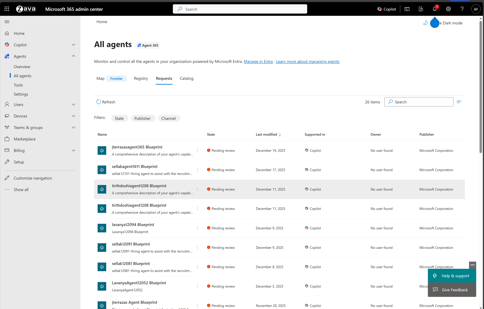
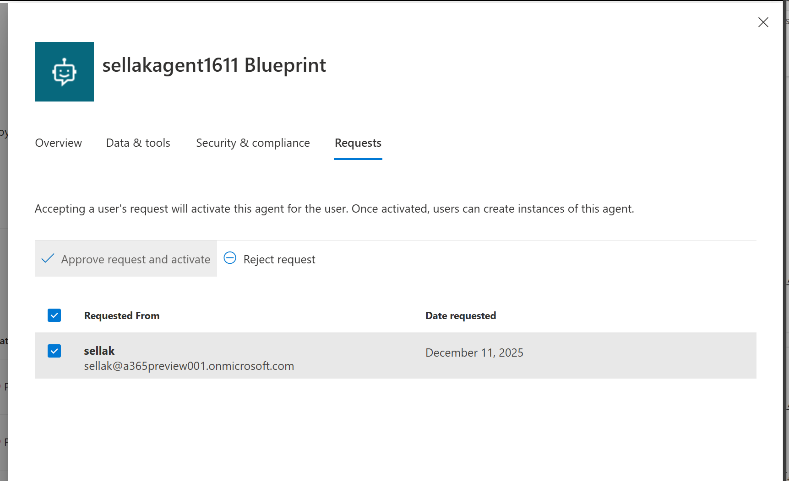
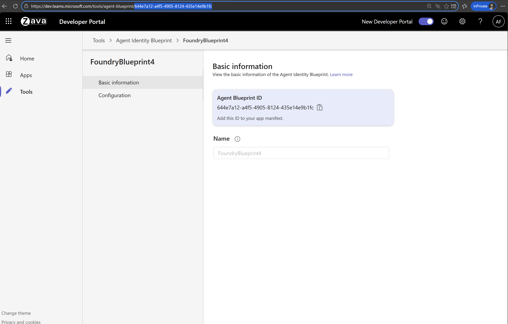
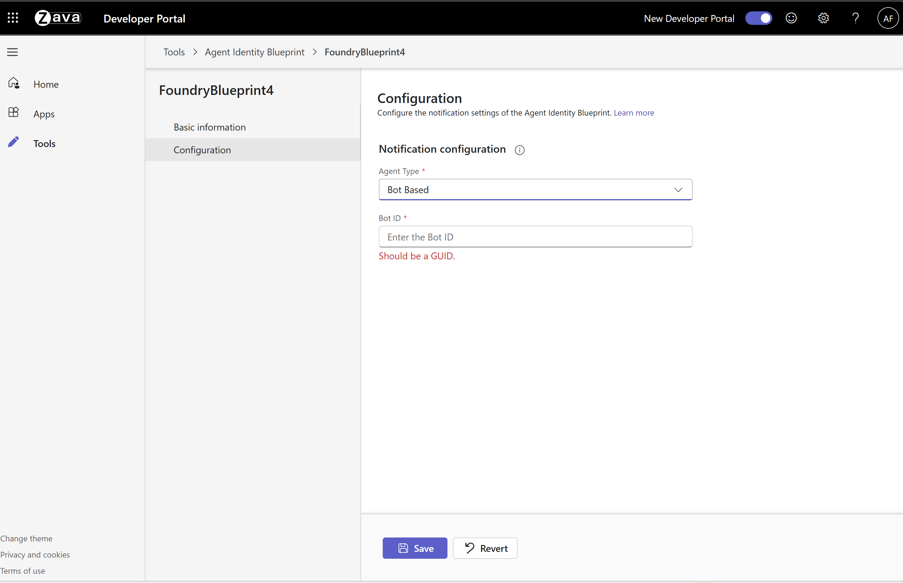

# 🤖 Foundry A365 Agent Example

> A minimal example of deploying a Foundry A365 agent with Azure Developer CLI

---

## 📋 Prerequisites

**Note:** You must be enrolled in the [Frontier preview program](https://adoption.microsoft.com/en-us/copilot/frontier-program/) to publish a Foundry agent to Microsoft Agent 365.

Ensure you have the following installed:

| Requirement | Description |
|------------|-------------|
| [Azure Developer CLI](https://learn.microsoft.com/azure/developer/azure-developer-cli/install-azd) | Infrastructure deployment tool |
| [Docker](https://docker.com) | Container runtime |
| [.NET 9.0 SDK](https://dotnet.microsoft.com/download) | Development framework |


### 🔐 Required Permissions

- **Owner** role on the Azure subscription
- **Azure AI User** or **Cognitive Services User** role at subscription or resource group level
- **Tenant Admin** role for organization-wide configuration

---

## 🚀 Quick Start

### Step 1: Authenticate

Login to your Azure tenant and authenticate with Azure Developer CLI:

```powershell
# Login to Azure CLI
az login

az login --scope https://ai.azure.com/.default

az login --scope https://graph.microsoft.com//.default

# Login to Azure Developer CLI
azd auth login
```

### Step 2: Deploy Everything

**Note:** Hosted agents are only available in the **North Central US** region. All resources must be created in this region.

#### Optional: Customize Your Agent

Before deploying, you can customize:
- **Agent instructions:** [AgentInstructions.cs](./src/hello_world_a365_agent/AgentLogic/AgentInstructions.cs)
- **MCP tools:** [ToolManifest.json](./src/hello_world_a365_agent/ToolingManifest.json) - [Learn more](https://learn.microsoft.com/en-us/microsoft-agent-365/tooling-servers-overview)

#### Deploy

Ensure Docker is running, then execute:

```powershell
azd provision --verbose
```

After deployment completes, retrieve your resource values:

```powershell
azd env get-values
```

### Step 3: Approve Your Agent

1. Navigate to the [Microsoft 365 admin center](https://admin.cloud.microsoft/?#/agents/all/requested)
2. Under **Requests**, locate your agent:
   

3. Click the **Approve request and activate** button:
   

### Step 4: Configure Teams Integration

1. Open the [Teams Developer Portal](https://dev.teams.microsoft.com/tools/agent-blueprint) and locate your agent blueprint
    
   **Note:** Only 100 Agent Blueprints are displayed. If yours isn't visible, click any blueprint to open its details page, then in the browser's address bar replace the blueprint ID portion of the URL with your own Blueprint ID from the previous step (for example: `https://dev.teams.microsoft.com/tools/agent-blueprint/<your-blueprint-id>`).
   

2. Get your Blueprint ID:
   ```powershell
   azd env get-values
   ```

3. Navigate to **Configuration** and add your **Bot ID** (same as Blueprint ID):
   

### Step 5: Create Agent Instances

1. In Microsoft Teams, navigate to **Apps** → **Agents for your team**
2. Find your agent and create an instance:
   

---

## 🏗️ Architecture Overview

This deployment orchestrates six key components to create a fully functional A365 agent:

### 1️⃣ Creating a Foundry Project

Creates a Foundry project configured to support hosted agents with appropriate permissions on an Azure Container Registry for building and storing Docker images.

📚 [Learn more about prerequisites](https://github.com/microsoft/container_agents_docs?tab=readme-ov-file#11---prerequisites)

### 2️⃣ Creating an Application

Applications provide stable endpoints and identity for exposing your agent to users while maintaining development flexibility within Foundry. The application is configured to accept requests from Azure Bot Service.

### 3️⃣ Setting up Azure Bot Service

Azure Bot Service acts as a relay between M365 ecosystem interactions and the Foundry application. The bot is configured with:

- Application endpoint
- Application's agent blueprint identity as the appId

### 4️⃣ Building a Hosted Agent

Compiles the sample code into a Docker container and registers it as a hosted agent with the Foundry project.

📚 [Learn more about building agents](https://github.com/microsoft/container_agents_docs?tab=readme-ov-file#14---build-agent-image)

### 5️⃣ Deploying the Agent

Deploys the hosted agent to the application, granting it:

- Access to the application's identity
- Configuration to serve application requests

📚 [Learn more about agent deployment](https://github.com/microsoft/container_agents_docs?tab=readme-ov-file#step-2-deploy-agent)

### 6️⃣ Publishing to Your Organization

Publishes the application to Microsoft 365 via Foundry API, creating a hireable digital worker with:

- Digital worker metadata
- Agent blueprint ID
- Digital worker designation

> **⚠️ Important**: The agent requires [admin approval](https://learn.microsoft.com/en-us/entra/identity/enterprise-apps/review-admin-consent-requests#review-and-take-action-on-admin-consent-requests-1) before becoming available for hiring.

---

## 📖 Additional Resources

- [Foundry Container Agents Documentation](https://github.com/microsoft/container_agents_docs)
- [Azure Developer CLI Documentation](https://learn.microsoft.com/azure/developer/azure-developer-cli/)
- [Agent Blueprint Configuration](https://dev.teams.microsoft.com/tools/agent-blueprint)

---

## 🤝 Support

For issues or questions, please refer to the official documentation or contact your Azure administrator.

